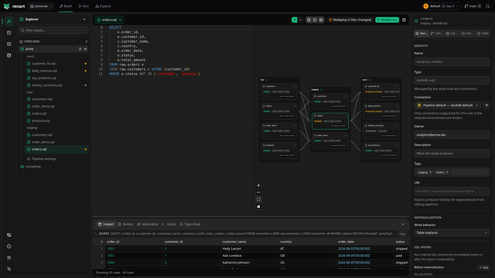

# Renart

<p align="center">
  <a href="https://github.com/renart-data/renart/blob/main/LICENSE"></a>
  <a href="https://github.com/renart-data/renart/tags"></a>
  <a href="https://github.com/renart-data/renart/actions/workflows/ci.yml"></a>
  <a href="https://github.com/renart-data/renart/actions/workflows/e2e-live.yml"></a>
</p>

Renart is an open-source, local-first, all-in-one IDE for building and running
data pipelines from a Git repository.

Build pipelines on a visual canvas, edit SQL and Python with pipeline-aware
IntelliSense, explore data in notebooks, compose checked dashboards and
reports, and inspect or materialize assets from one workspace. Renart runs on
your machine and keeps your work as plain, reviewable files.

> [!IMPORTANT]
> **Renart is currently in public alpha.** The core build, inspect, run,
> schedule, notebook, type-checking, and freshness workflows are available, but
> expect rough edges and changes before the first stable release. Keep your
> pipelines in Git, evaluate Renart before relying on it for critical production
> scheduling, and please report issues on
> [GitHub](https://github.com/renart-data/renart/issues).



## Highlights

- See assets, dependencies, lineage, and staleness on a visual pipeline canvas.
- Get pipeline-aware SQL completion and type-checking while you edit.
- Inspect data safely before materializing an asset or building a pipeline.
- Combine warehouse, file, object-storage, and HTTP data in typed notebooks,
  then promote useful work into pipeline assets.
- Build version-controlled dashboards and reports with checked visualizations
  and interactive controls.
- Run and schedule pipelines per environment, with logs and history in the UI.
- Review every authored change as an ordinary Git diff.

## Install

```bash
curl -LsSf getrenart.com/install.sh | sh
```

Start Renart inside a Git repository:

```bash
renart
```

This opens the Renart IDE in a native window, with an automatic browser fallback
when the platform webview is unavailable. The matching native-window helper is
included in each release archive and installed by the one-line installer.

Release archives support Linux x86-64/ARM64 (glibc 2.31+), macOS
Intel/Apple silicon, and Windows x86-64. See the
[installation guide](https://getrenart.com/docs/installation/) for details.

## Documentation

- [Quickstart](https://getrenart.com/docs/quickstart/)
- [Full documentation](https://getrenart.com/docs/)
- [Connection credentials](https://getrenart.com/docs/connections-environments/managing-credentials/)
- [CLI reference](https://getrenart.com/docs/reference/cli/)

## License

Renart is licensed under the Apache License 2.0. See [`LICENSE`](LICENSE).
Licenses and required notices for bundled third-party software are collected in
[`THIRD_PARTY_NOTICES.md`](THIRD_PARTY_NOTICES.md).

See [`CONTRIBUTING.md`](CONTRIBUTING.md) to contribute. Please report suspected
vulnerabilities privately as described in [`SECURITY.md`](SECURITY.md).
